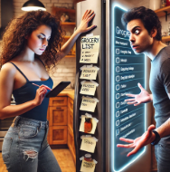
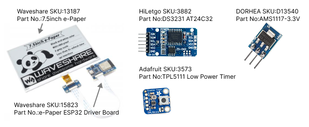

# Ultra Low power Electronic Paper Display Project (EPD)

Author: [M. Maia](https://github.com/marcomalandro)

My fiance was using a notepad to keep track of her grocery list on her fridge. I joked that I should build her a more legitimate grocery list and so here we are.

The requirements:

- standalone unit on the fridge
- unit displays the grocery list (and perhaps a few other useful pieces of information like time, weather and a daily quote)

This means it has to last on battery at least 180 days, otherwise it would get annoying to change batteries or recharge the unit.

## Hardware

The driver and display are from [Waveshare Electronics](https://www.waveshare.com/):

- [E-Paper_ESP32_Driver_Board](https://www.waveshare.com/wiki/E-Paper_ESP32_Driver_Board)
- [7.5inch E-Ink display, 800×480, B/W](https://www.waveshare.com/product/displays/e-paper/7.5inch-e-paper.htm)
- [DS3231 RTC](http://www.hiletgo.com/ProductDetail/2164495.html)
- [AMS1117-3.3 LDO](https://www.amazon.com/HiLetgo-AMS1117-3-3-Step-Down-Module-AMS1117-3-3V/dp/B01HXU1NQY)
- [Adafruit TPL5111 Low Power Timer](https://www.adafruit.com/product/3573)

See [Hardware Pinouts](PINOUTS.md).

## Software

See [Building Firmware](BUILD.md) for details on compiling and running the code.

## Notes

See [CHANGELOD](./CHANGELOG.md).